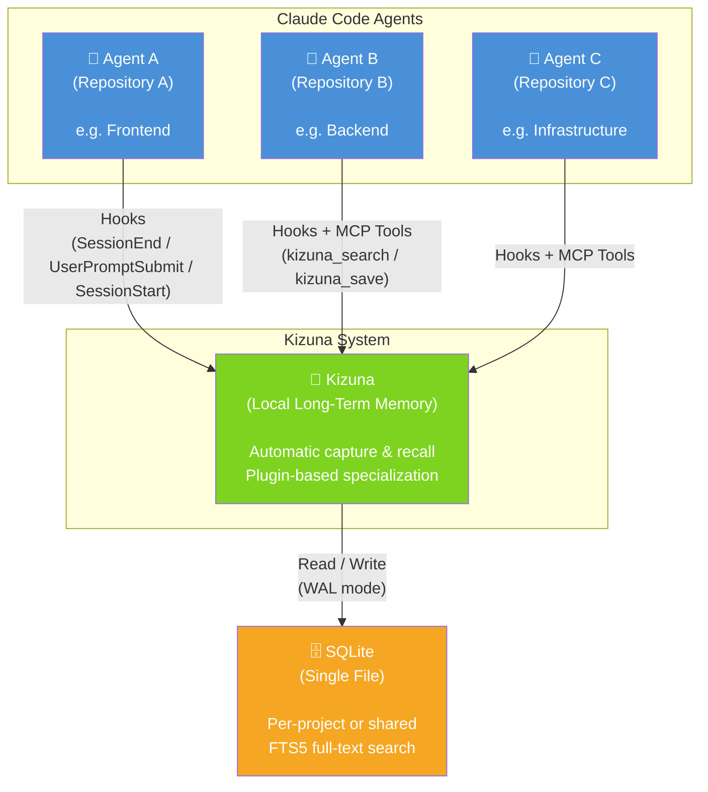
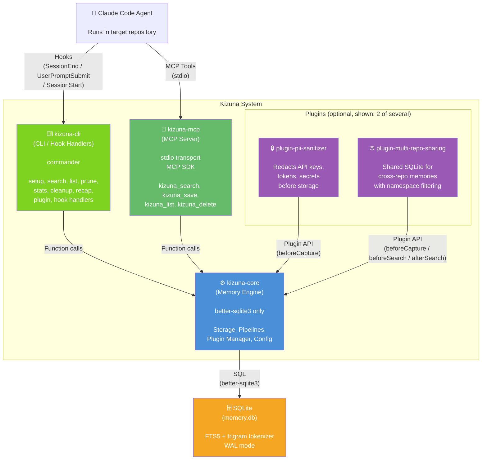
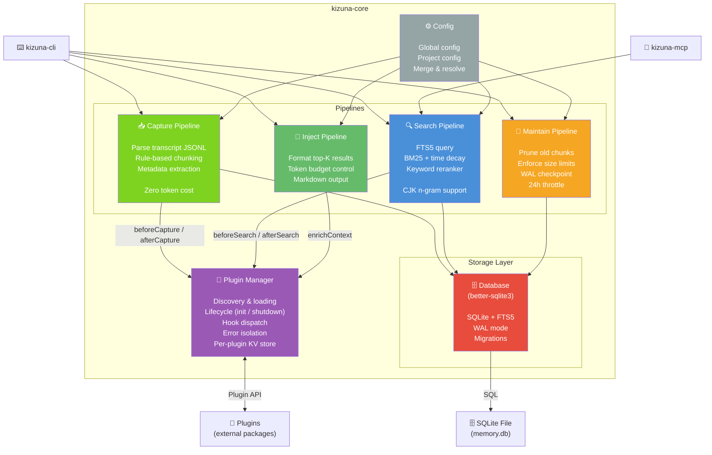

# Kizuna C4 Architecture Model

Created: 2026-05-16
Scope: Kizuna — Plugin-based local long-term memory for Claude Code

---

## Level 1: System Context

How external users (Claude Code agents) and systems interact with Kizuna.



### Actors

| Actor             | Interaction                               | Purpose                                                             |
| ----------------- | ----------------------------------------- | ------------------------------------------------------------------- |
| Claude Code Agent | Hooks (automatic) + MCP tools (on-demand) | Save session transcripts, recall relevant memories, search actively |

### External Systems

| System               | Role                                                       | Communication                                   |
| -------------------- | ---------------------------------------------------------- | ----------------------------------------------- |
| SQLite (single file) | Persistent storage for memories, sessions, and plugin data | Direct file I/O (WAL mode, busy_timeout)        |
| Target Projects      | Repositories where Claude Code agents run                  | Hooks registered per-project via `kizuna setup` |

### Design Principles Reflected

- **No external dependencies**: All data stays in a local SQLite file (Principle 1)
- **Auto save / Always recall**: Hooks fire automatically, no manual action needed (Principles 3, 4)

---

## Level 2: Container

The technical containers (executable units / packages) that compose the Kizuna system.



### Container List

| Container                     | Technology                  | Responsibility                                                                                                                          |
| ----------------------------- | --------------------------- | --------------------------------------------------------------------------------------------------------------------------------------- |
| **kizuna-cli**                | TypeScript, commander       | CLI commands (setup, search, list, prune, stats, cleanup, recap, plugin) and hook handlers (SessionEnd, UserPromptSubmit, SessionStart) |
| **kizuna-mcp**                | TypeScript, MCP SDK (stdio) | MCP server exposing tools (kizuna_search, kizuna_save, kizuna_list, kizuna_delete) for active agent queries                             |
| **kizuna-core**               | TypeScript, better-sqlite3  | Generic memory engine: storage layer, pipelines (capture, search, inject, maintain), plugin manager, configuration                      |
| **plugin-pii-sanitizer**      | TypeScript                  | Redacts API keys, tokens, and secrets from chunks before storage via `beforeCapture` hook                                               |
| **plugin-multi-repo-sharing** | TypeScript                  | Enables cross-repository memory search via federated read-only queries to referenced project databases                                  |
| _(and others)_                | TypeScript                  | Additional plugins include hybrid-search (FTS5 + sqlite-vec), openapi-awareness, etc.                                                   |
| **SQLite**                    | SQLite + FTS5 (trigram)     | Persistent storage for sessions, chunks, FTS index, maintenance metadata, and plugin KV store                                           |

### Dependency Rules

| From        | To                                  | Allowed?                                          |
| ----------- | ----------------------------------- | ------------------------------------------------- |
| kizuna-cli  | kizuna-core                         | Yes                                               |
| kizuna-mcp  | kizuna-core                         | Yes                                               |
| plugin-\*   | kizuna-core (types only)            | Yes                                               |
| kizuna-core | kizuna-cli / kizuna-mcp / plugin-\* | **No** (core must never depend on outer packages) |

### Hook Integration

| Hook             | Handler                                   | Latency Budget |
| ---------------- | ----------------------------------------- | -------------- |
| SessionStart     | CLI: inject baseline context              | < 200ms        |
| UserPromptSubmit | CLI: search + inject relevant memories    | < 100ms        |
| SessionEnd       | CLI: capture transcript + run maintenance | < 5s           |

---

## Level 3: Component (kizuna-core)

Internal components of the core memory engine.



### Component List

| Component              | Responsibility                                | Key Details                                                                                                                                                                                                                                      |
| ---------------------- | --------------------------------------------- | ------------------------------------------------------------------------------------------------------------------------------------------------------------------------------------------------------------------------------------------------ |
| **Capture Pipeline**   | Parse session transcripts and store as chunks | JSONL parsing, rule-based chunking (one chunk per turn), metadata extraction. No LLM calls (Principle 2).                                                                                                                                        |
| **Search Pipeline**    | Find relevant memories for a given query      | FTS5 full-text search with trigram tokenizer, BM25 ranking with time decay, keyword-based reranking. Supports English and Japanese (CJK n-gram).                                                                                                 |
| **Inject Pipeline**    | Format search results for prompt injection    | Selects top-K results within a token budget, formats as Markdown, outputs augmented prompt.                                                                                                                                                      |
| **Maintain Pipeline**  | Prevent database bloat                        | Prunes chunks older than threshold (default: 90 days), enforces size limit (default: 100 MB), removes empty sessions, WAL checkpoint. Runs at most once per 24 hours (Principle 7).                                                              |
| **Plugin Manager**     | Manage plugin lifecycle and hook dispatch     | Discovers plugins (config-declared + auto-discovered), manages init/shutdown lifecycle, dispatches pipeline hooks (beforeCapture, afterCapture, beforeSearch, afterSearch, enrichContext), isolates plugin errors, provides per-plugin KV store. |
| **Database (Storage)** | SQLite access layer                           | Wraps better-sqlite3 with WAL mode, schema migrations, CRUD operations for sessions/chunks, FTS5 index management. The only external dependency in core (Principle 6).                                                                           |
| **Config**             | Configuration loading and resolution          | Loads global config (`~/.config/kizuna/config.json`) and project config (`.kizuna/config.json`), merges with project config taking precedence.                                                                                                   |

### Data Flow: Save Path (Capture)

```
Claude Code session ends
  → SessionEnd hook fires
    → CLI reads transcript JSONL
      → Plugin Manager: beforeCapture hooks
        → Capture Pipeline: rule-based chunking
          → Plugin Manager: afterCapture hooks
            → Database: insert into SQLite (chunks + FTS5)
              → Maintain Pipeline: cleanup if 24h since last run
```

### Data Flow: Recall Path (Inject)

```
User submits prompt
  → UserPromptSubmit hook fires
    → Plugin Manager: beforeSearch hooks
      → Search Pipeline: FTS5 + BM25 + time decay
        → Plugin Manager: afterSearch hooks
          → Inject Pipeline: format top-K results
            → Plugin Manager: enrichContext hooks
              → Augmented prompt output to Claude Code
```

### Data Flow: MCP Path (Active Search)

```
Agent invokes MCP tool (e.g. kizuna_search)
  → MCP Server receives request
    → Same Search Pipeline (steps above)
      → MCP Server returns formatted results
```

### Plugin Hook Points

| Hook                       | Pipeline Stage           | Purpose                                             |
| -------------------------- | ------------------------ | --------------------------------------------------- |
| `beforeCapture(chunk)`     | Capture, before storage  | Transform or filter chunks (e.g. PII redaction)     |
| `afterCapture(chunk)`      | Capture, after storage   | Post-processing (e.g. cross-repo tagging)           |
| `beforeSearch(query)`      | Search, before FTS5      | Transform query (e.g. expand keywords)              |
| `afterSearch(results)`     | Search, after ranking    | Rerank or filter results (e.g. namespace filtering) |
| `enrichContext(injection)` | Inject, after formatting | Add extra context blocks (e.g. shared memories)     |
